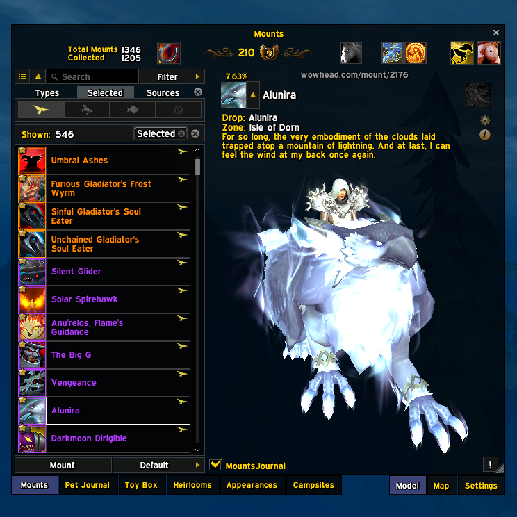
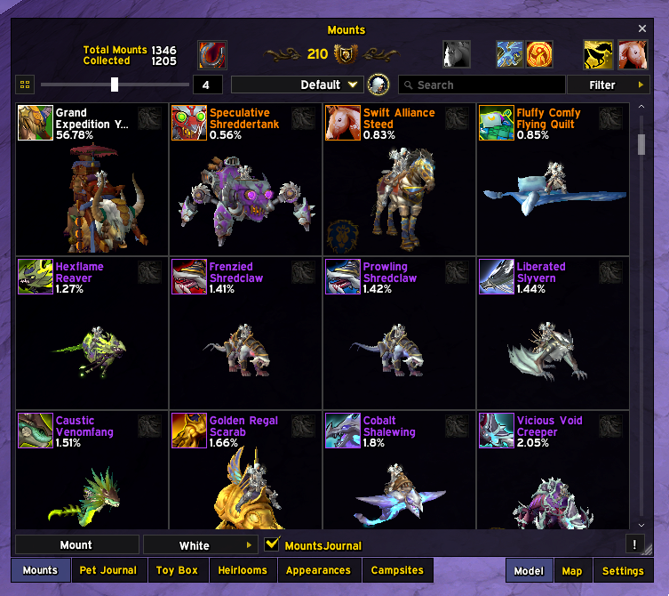
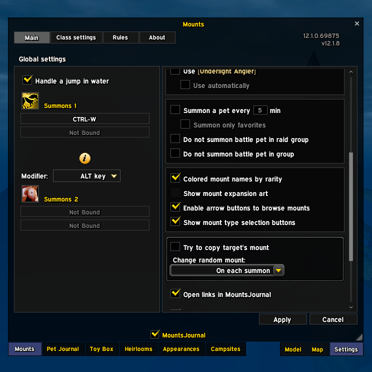
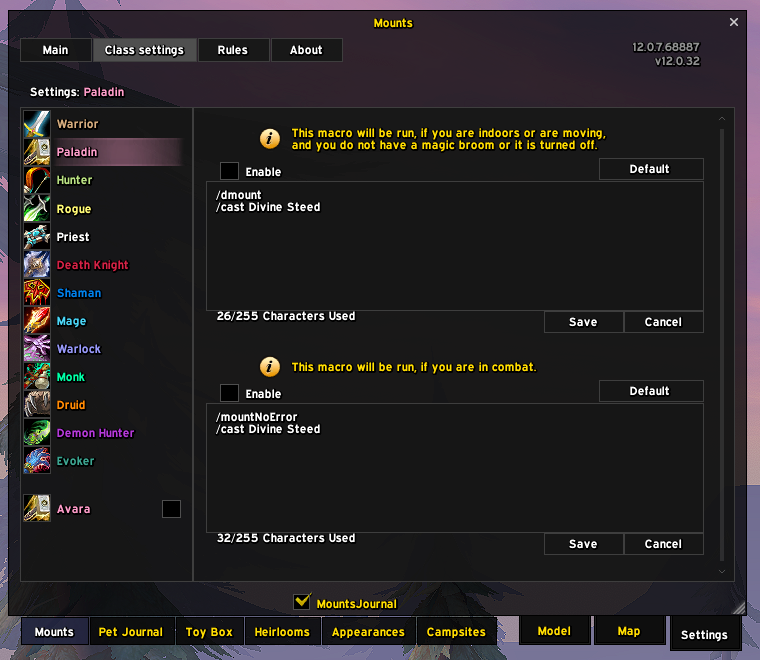

# MountsJournal EllesmereUI Skin

Reskins [MountsJournal](https://github.com/sfmict/MountsJournal) to match
[EllesmereUI](https://github.com/EllesmereGaming/EllesmereUI).

You need both addons installed. This one contains no part of either, and if
you're not running both it quietly does nothing.

The whole idea is that it follows *your* EllesmereUI setup rather than imposing a
look of its own. Window colour, transparency, accent, font and border all come
from your active profile, read fresh each time. Change something in EllesmereUI
and the journal changes with it.

## Screenshots

| | |
|---|---|
|  |  |
| The journal picking up a Dark Mode profile, colour and transparency both | Grid view, with the mounts per row slider |
|  |  |
| MountsJournal's own settings, skinned to match | Class settings, with the class list and macro editors |

## Installing

Drop the folder into `World of Warcraft/_retail_/Interface/AddOns/`, or grab it
from the [releases page](../../releases) with your addon manager.

## What it takes from EllesmereUI

Nothing is hardcoded, and no profile gets special treatment. Imports like
atrocityUI or AES work simply because they write these same values.

| Look | Where it comes from |
|---|---|
| Window colour and transparency | `EllesmereUI.GetDarkModeFill()`, your profile's Dark Mode fill, colour and alpha both |
| Accent (selections, checkmarks, sliders) | `EllesmereUI.ELLESMERE_GREEN` |
| UI font | `EllesmereUI.GetFontPath("blizzardSkin")` |
| Window border | `EllesmereUIDB.windowBorderTexture` and `windowBorderSize`, including a size of 0 meaning no border |
| Window style | `EllesmereUI.GetBlizzWindowStyle("collections")` |

These get re-read every time something is painted, never cached. Switch profile,
reopen the journal, done. There's nothing to import or keep in sync.

## Options

**Game Menu > Options > AddOns > MountsJournal EllesmereUI Skin**

| Setting | Default | What it does |
|---|---|---|
| Window backdrop | EllesmereUI Dark Mode | Uses your Dark Mode colour and alpha. The other choice, Blizzard window art, uses EllesmereUI's own window texture, which is fully opaque and can't be made see through. |
| Follow EllesmereUI opacity | on | Uses your Dark Mode alpha. Turn it off if you'd rather set the transparency yourself. |
| Opacity | 90 | Your own transparency setting. Ignored while the option above is on. |
| Window edge | Thin dark line | A crisp 1px edge. The alternative, EllesmereUI window frame, matches its windows exactly but brings a soft inner shading with it. |
| Border style | Follow EllesmereUI | Whatever border you've set in EllesmereUI's own options, texture and size. You can also pick one yourself from its border list, including Glow, Shadow and any LibSharedMedia borders. |
| Border size | 2 | Thickness, 1 to 4. Ignored while following EllesmereUI. |

## What it actually touches

**MountsJournal's own frames**, all over: the journal window, the mount and pet
lists, the filter bar, the map and model tabs, and the config, rules, snippets
and icon picker windows. Art is only ever faded, never hidden. Nothing is
reparented or has its scripts replaced, and every hook is a `HookScript` or
`hooksecurefunc`.

**Blizzard's Collections and MountJournal frames**, in one specific way. Their
chrome is faded while the journal is open and put back when it closes.
MountsJournal parents its window inside Blizzard's mount journal, so both sit
right behind it, and without this they'd show through a transparent backdrop.
Only regions are touched, never frames, and only the parts that actually overlap
our window. The Collections tab row underneath is left alone.

The Model/Map/Settings row is flattened so it matches the Collections tabs next
to it, which EllesmereUI already strips as part of skinning that window.

Cost is a one off pass at login plus hooks. There's no `OnUpdate`, no polling and
no per frame work, and the internal registries use weak keys so recycled rows can
still be collected.

## If something looks wrong

`/mjeuiskin` tells you what actually ran: which backend is live, the colours and
border it resolved, and any stage that failed along with the Lua error. Each
section is isolated, so if a frame moves in a MountsJournal update you lose that
section rather than the whole window.

There are two more focused commands. `/mjeuiskin behind` lists anything still
drawing behind the window, biggest first. `/mjeuiskin tabs` compares our tab
labels and art against the Collections row beside them. Both print what the
frames really carry, texture, size, colour and alpha, which is usually the
fastest way to tell a bug here apart from a Blizzard or EllesmereUI change.

## Compatibility

Works on EllesmereUI 8.6.6 and newer. On 8.6.8+ with the Blizzard Skin child
addon running, it registers through the official skinning API: the skin shows
up under EllesmereUI's Blizzard Window Skins > Third-Party Addons and follows
its toggles there, and a live accent or profile change repaints the journal
without a reload. The window shell, scroll bars and checkboxes are always
drawn by this addon itself, so the look is identical on every version and the
backdrop and opacity options keep working. On 8.6.6, or without the child
addon, the same set of primitives is rebuilt from the public helpers
EllesmereUI does export. You don't need to do anything either way, and
`/mjeuiskin` will tell you which backend is running.

## Licence

GPLv3. This is a derivative work of
[MountsJournal_ElvUI_Skin](https://github.com/sfmict/MountsJournal-ElvUI-Skin) by
sfmict. The map of which frames need skinning came from there; the EllesmereUI
implementation is new. Thanks to sfmict, who wrote both MountsJournal and the
ElvUI skin this was translated from, and to EllesmereGaming for EllesmereUI.

Unofficial, and not affiliated with either project.
